<p align="center">
  
</p>

<h1 align="center">FishFeed</h1>

<p align="center">
  Sistem pemberi pakan ikan otomatis berbasis ESP32 dengan aplikasi pendamping Flutter.<br>
  <i>An ESP32-based automatic fish feeder with a Flutter companion app.</i>
</p>

<p align="center">
  <a href="https://github.com/khaichi11/Aplikasi-Sistem-Tertanam-FishFeed/actions/workflows/ci.yml"></a>
</p>

<p align="center">
  <a href="#bahasa-indonesia">Bahasa Indonesia</a> · <a href="#english">English</a>
</p>

<p align="center">
  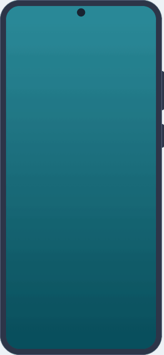
</p>

<table>
  <tr>
    <td align="center" width="25%">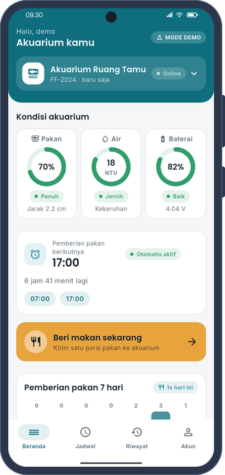<br><sub>Dashboard</sub></td>
    <td align="center" width="25%">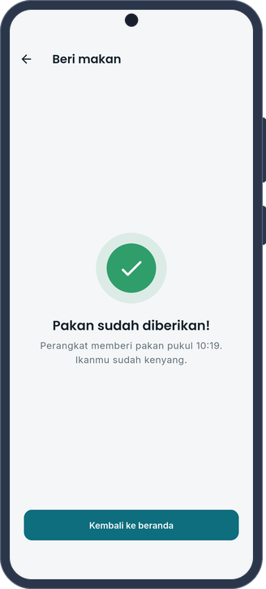<br><sub>Beri makan / Feed now</sub></td>
    <td align="center" width="25%">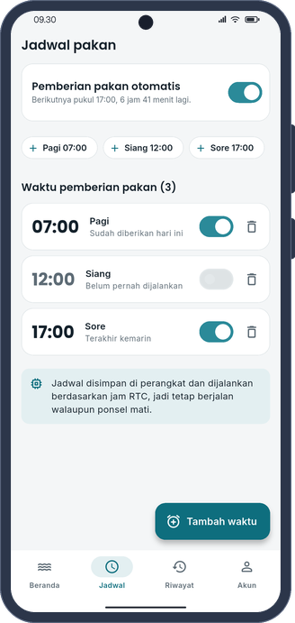<br><sub>Jadwal / Schedule</sub></td>
    <td align="center" width="25%">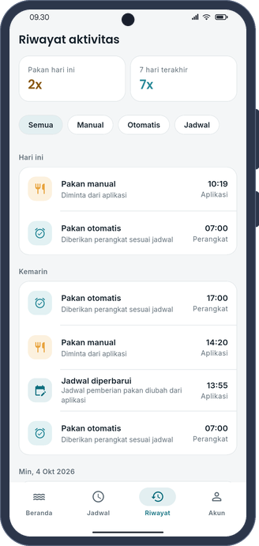<br><sub>Riwayat / History</sub></td>
  </tr>
</table>

---

## Bahasa Indonesia

### Tentang

FishFeed terdiri atas dua bagian yang saling melengkapi. Bagian pertama adalah firmware ESP32 di
[`Final_Embed/`](Final_Embed) yang membaca sisa pakan, kekeruhan air, dan tegangan baterai, menggerakkan servo
penjatuh pakan, serta menjalankan jadwal berdasarkan jam RTC. Setiap tugas berjalan sebagai task FreeRTOS, dan
perangkat memasuki mode deep sleep di antara siklus kerja untuk menghemat daya. Bagian kedua adalah aplikasi Flutter
di [`embed/`](embed) yang dipakai untuk memantau akuarium, memberi pakan dari jarak jauh, mengatur jadwal, dan
meninjau riwayat pemberian pakan.

Aplikasi dan perangkat tidak pernah berkomunikasi secara langsung. Seluruh data dipertukarkan melalui Firebase,
sehingga keduanya tidak harus berada di jaringan yang sama.


### Fitur aplikasi

Halaman dashboard menampilkan sisa pakan, kejernihan air, dan kondisi baterai dalam bentuk cincin indikator. Aplikasi
juga memberikan peringatan otomatis ketika pakan menipis atau habis, air menjadi keruh, baterai melemah, atau perangkat
sedang tidak terhubung. Ketika pengguna menekan tombol beri makan, aplikasi menunggu hingga perangkat benar-benar
menjatuhkan pakan sebelum menampilkan konfirmasi bahwa pakan sudah diberikan.

Jadwal otomatis dapat ditambah dengan waktu bebas atau dengan pilihan pagi, siang, dan sore. Setiap waktu dapat
diaktifkan atau dinonaktifkan secara terpisah, dilengkapi keterangan kapan terakhir dijalankan dan hitung mundur
menuju pemberian berikutnya. Riwayat dikelompokkan per hari dengan saringan manual, otomatis, dan terjadwal, serta
dilengkapi grafik pemberian pakan selama tujuh hari terakhir.

Satu akun dapat mengelola beberapa perangkat sekaligus: perangkat dipasangkan melalui ID, dapat diganti namanya,
dilepas, dan dipilih sebagai perangkat aktif. Apabila konfigurasi Firebase belum tersedia, aplikasi berjalan dalam
mode demo dengan perangkat simulasi, sehingga dapat dicoba tanpa alat maupun kunci API.

Saat dibuka, panel air naik dari bawah sampai seluruh layar menjadi akuarium, lalu sapaan "Halo!" mengapung di
permukaannya. Tiga ikan berenang, butiran pakan sesekali jatuh seperti saat alat bekerja, dan ikan berbalik mendekat
untuk memakannya. Pengguna dapat mengetuk di mana saja untuk menabur pakan, dan pembuka menunggu selama pengguna masih
memberi makan sebelum memudar ke aplikasi. Bila Firebase belum diatur, halaman masuk cukup menampilkan keterangan
singkat "Mode demo" di bawah tombol akun demo, bukan kotak peringatan.

Status pakan memakai ambang yang sama dengan persentase pada cincin indikator: jarak sensor 5 cm atau lebih berarti
kosong (0%), di atas 3 cm berarti menipis, dan selebihnya cukup. Bila wadah terbaca kosong, aplikasi mengingatkan
sebelum perintah beri makan dikirim.

### Tangkapan layar

<table>
  <tr>
    <td align="center" width="25%">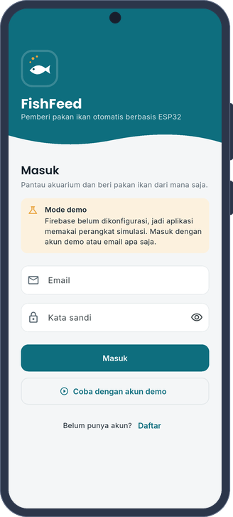<br><sub>Masuk</sub></td>
    <td align="center" width="25%"><br><sub>Dashboard</sub></td>
    <td align="center" width="25%">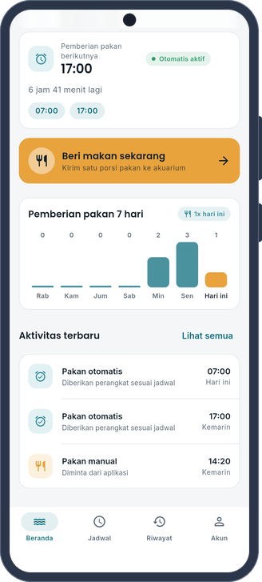<br><sub>Grafik dan aktivitas</sub></td>
    <td align="center" width="25%">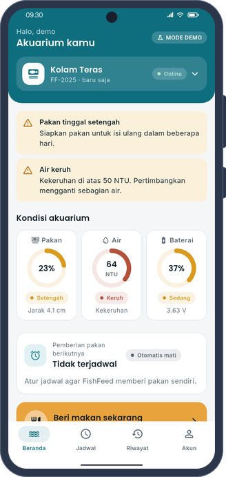<br><sub>Peringatan</sub></td>
  </tr>
  <tr>
    <td align="center" width="25%"><br><sub>Beri makan</sub></td>
    <td align="center" width="25%"><br><sub>Jadwal</sub></td>
    <td align="center" width="25%"><br><sub>Riwayat</sub></td>
    <td align="center" width="25%">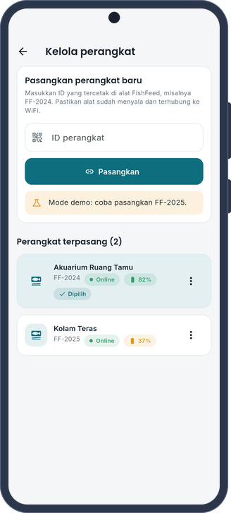<br><sub>Kelola perangkat</sub></td>
  </tr>
  <tr>
    <td align="center" width="25%">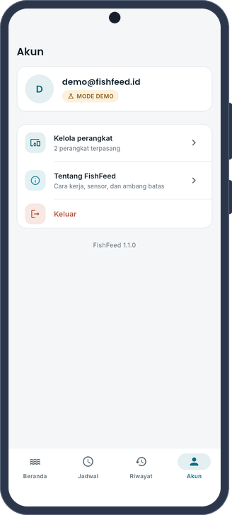<br><sub>Akun</sub></td>
    <td align="center" width="25%">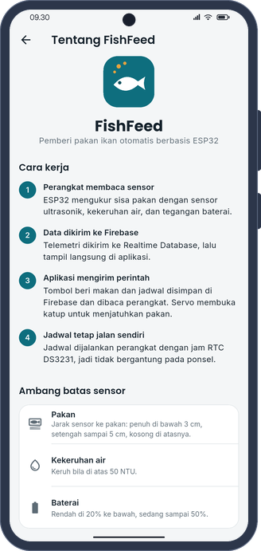<br><sub>Tentang</sub></td>
    <td width="25%"></td>
    <td width="25%"></td>
  </tr>
</table>

Seluruh tangkapan layar dibuat secara otomatis oleh integration test di emulator Android dalam mode demo. Bingkai
ponsel digambar sendiri dengan skrip `phone_frame.py` dari repo [MEIRA](https://github.com/khaichi11/MEIRA)
(Apache-2.0), tanpa memakai templat perangkat dari pihak lain.

### Alur pemberian pakan


### Perangkat keras

| Komponen | Fungsi |
| --- | --- |
| ESP32 DevKit V1 | Pengendali utama |
| RTC DS3231 | Penunjuk waktu untuk jadwal, tetap berjalan ketika WiFi terputus |
| Sensor ultrasonik HC-SR04 | Mengukur jarak ke permukaan pakan |
| Sensor kekeruhan | Mengukur kekeruhan air dalam NTU |
| Servo | Membuka katup penjatuh pakan |
| Baterai dan pembagi tegangan | Sumber daya sekaligus pembacaan persentase baterai |


| Pin ESP32 | Sambungan |
| --- | --- |
| GPIO 21 | SDA RTC DS3231 |
| GPIO 22 | SCL RTC DS3231 |
| GPIO 5 | TRIG sensor ultrasonik |
| GPIO 18 | ECHO sensor ultrasonik, melalui pembagi tegangan 5 V ke 3,3 V |
| GPIO 34 | Keluaran analog sensor kekeruhan |
| GPIO 32 | Pembagi tegangan baterai |
| GPIO 13 | Sinyal servo |

### Struktur data Firebase


Firmware dan aplikasi memakai format data yang sama. Oleh karena itu, setiap perubahan pada salah satunya perlu
diikuti perubahan yang sesuai pada yang lain.

### Menjalankan aplikasi

Aplikasi memerlukan Flutter 3.41 dan Android SDK. Tanpa konfigurasi tambahan, aplikasi berjalan dalam mode demo.

```bash
cd embed
flutter pub get
flutter run
```

Untuk masuk, gunakan tombol **Coba dengan akun demo** atau alamat email apa pun. Pada halaman Kelola perangkat,
perangkat simulasi dapat dipasangkan dengan ID `FF-2025`.

#### Mode Firebase dengan alat sungguhan

1. Buat proyek di [Firebase Console](https://console.firebase.google.com), lalu aktifkan **Authentication**
   (Email/Password), **Realtime Database**, dan **Cloud Firestore**.
2. Pasang aturan keamanan dari [`docs/firebase/database.rules.json`](docs/firebase/database.rules.json) dan
   [`docs/firebase/firestore.rules`](docs/firebase/firestore.rules).
3. Daftarkan aplikasi Android, salin `embed/firebase.example.json` menjadi `embed/firebase.json`, kemudian isi
   nilainya. Berkas ini tidak pernah dimasukkan ke repositori.
4. Jalankan atau bangun aplikasi dengan konfigurasi tersebut:

```bash
flutter run --dart-define-from-file=firebase.json
flutter build apk --release --dart-define-from-file=firebase.json
```

Berkas `google-services.json` tidak diperlukan karena konfigurasi dibaca saat proses build. Apabila konfigurasi tidak
lengkap, aplikasi kembali ke mode demo secara otomatis.

### Mengunggah firmware

Pengunggahan memerlukan Arduino IDE atau `arduino-cli` dengan paket papan **ESP32** serta pustaka **Firebase Arduino
Client Library for ESP8266 and ESP32**, **ESP32Servo**, dan **RTClib**.

1. Salin `Final_Embed/config.example.h` menjadi `Final_Embed/config.h`.
2. Isi data WiFi, kunci Firebase, akun perangkat, dan `DEVICE_ID`. Akun perangkat sebaiknya berupa pengguna
   Email/Password tersendiri di Firebase Authentication.
3. Buka `Final_Embed/Final_Embed.ino`, pilih papan **ESP32 Dev Module**, lalu unggah.
4. Buat `devices/{DEVICE_ID}/info/name` di Realtime Database, misalnya "Akuarium Ruang Tamu", agar perangkat dapat
   dipasangkan di aplikasi.

Berkas `config.h` berisi kredensial sehingga diabaikan oleh Git. Firmware menggunakan sekitar 96% ruang program pada
skema partisi bawaan karena ukuran pustaka Firebase cukup besar. Apabila ruang tidak mencukupi setelah fitur
ditambahkan, pilih **Tools > Partition Scheme > Huge APP (3MB No OTA)**.

Dalam satu siklus, perangkat bangun dari mode tidur, membaca sensor, terhubung ke WiFi dan Firebase, lalu mengirim
data. Setelah itu perangkat memeriksa perintah dan jadwal selama lima detik sebelum kembali tidur selama lima detik.
Apabila WiFi atau Firebase tidak tersedia, perangkat tidur selama tiga puluh detik lalu mencoba kembali, sehingga
tidak pernah macet. Jam RTC disinkronkan melalui NTP ketika perangkat pertama kali menyala dan kemudian kira-kira
setiap dua jam.

### Pengujian

```bash
cd embed
flutter analyze
flutter test
flutter drive --driver=test_driver/integration_test.dart \
  --target=integration_test/screenshots_test.dart
```

`flutter analyze` memeriksa kode secara statis, sedangkan `flutter test` menguji logika status sensor, peringatan,
jadwal, data demo, dan alur antarhalaman. Integration test menjalankan aplikasi di emulator sekaligus menghasilkan
tangkapan layar. Alur CI di GitHub Actions menjalankan analisis dan pengujian aplikasi, membangun APK, serta
mengompilasi firmware untuk ESP32.

GIF demo di bagian atas dirender di laptop tanpa emulator: `demo_render_test.dart` menggambar setiap layar dengan
backend demo dan menyimpan bingkainya, lalu `tool/render_gif.py` menyusunnya ke dalam bingkai ponsel.

```bash
cd embed
DEMO_FRAMES=build/frames flutter test test/demo_render_test.dart
python3 tool/render_gif.py build/frames ../docs/images/demo.gif
```

### Struktur repositori

```
Final_Embed/          firmware ESP32 (Arduino dan FreeRTOS)
embed/                aplikasi Flutter
  lib/data/           backend Firebase dan mode demo
  lib/logic/          status sensor, peringatan, jadwal, dan statistik
  lib/models/         model data sesuai kontrak firmware
  lib/ui/             halaman, tema, dan widget
  tool/               pembuat ikon aplikasi
docs/images/          tangkapan layar dan diagram
docs/firebase/        aturan keamanan Firebase
tools/                pembuat diagram dokumentasi
```

### Keamanan

Kredensial WiFi dan Firebase tidak pernah disimpan di repositori, dan riwayat Git telah dibersihkan dari kata sandi
yang sempat masuk. Apabila kata sandi WiFi atau akun perangkat lama masih digunakan, sebaiknya kata sandi tersebut
diganti.

### Lisensi aset

Logo, ikon, diagram, dan tangkapan layar dibuat khusus untuk proyek ini. Huruf Poppins dan Inter memakai SIL Open
Font License, sedangkan ikon antarmuka berasal dari Material Icons (Apache 2.0).

---

## English

### About

FishFeed consists of two complementary parts. The first is the ESP32 firmware in [`Final_Embed/`](Final_Embed), which
reads the remaining feed, water turbidity, and battery voltage, drives the feeding servo, and runs schedules based on
an RTC clock. Each job runs as a FreeRTOS task, and the board enters deep sleep between cycles to save power. The
second is the Flutter app in [`embed/`](embed), which is used to monitor the aquarium, feed the fish remotely, manage
schedules, and review the feeding history.

The app and the device never communicate directly. All data passes through Firebase, so the two do not need to be on
the same network.


### App features

The dashboard shows the remaining feed, water clarity, and battery level as ring gauges. The app also raises automatic
warnings when the feed is low or empty, the water becomes cloudy, the battery runs low, or the device goes offline.
When the user taps the feed button, the app waits until the device has actually dropped the food before confirming
that the fish have been fed.

Feeding times can be added freely or chosen from morning, noon, and evening presets. Each time can be switched on or
off on its own and shows when it last ran, together with a countdown to the next feeding. The history is grouped by
day with manual, automatic, and scheduled filters, and includes a chart of the last seven days.

One account can manage several devices: a device is paired by its ID and can be renamed, unpaired, or selected as the
active device. When no Firebase configuration is available, the app runs in demo mode with a simulated device, so it
can be tried without hardware or API keys.

On launch a panel of water rises from the bottom until the whole screen becomes an aquarium, and the greeting "Halo!"
floats near the surface. Three fish swim about, food pellets drop now and then as they do when the device runs, and the
fish turn and swim over to eat them. Tapping anywhere scatters food, and the opening waits while the user keeps
feeding before it fades into the app. When Firebase is not configured, the sign-in page shows a short "Mode demo" note
under the demo account button instead of a warning box.

The feed status uses the same thresholds as the percentage on the ring gauge: a sensor distance of 5 cm or more means
empty (0%), more than 3 cm means low, and anything closer means enough. When the hopper reads empty, the app warns the
user before the feed command is sent.

### Screenshots

<table>
  <tr>
    <td align="center" width="25%"><br><sub>Sign in</sub></td>
    <td align="center" width="25%"><br><sub>Chart and activity</sub></td>
    <td align="center" width="25%"><br><sub>Alerts</sub></td>
    <td align="center" width="25%"><br><sub>Devices</sub></td>
  </tr>
</table>

The screenshots are produced automatically by the integration test on an Android emulator in demo mode. The phone
frames are drawn with the `phone_frame.py` script from the [MEIRA](https://github.com/khaichi11/MEIRA) repository
(Apache-2.0); no third-party device mockups are used. The feeding flow, wiring, pin table, and Firebase data structure
are shown in the Indonesian section above.

### Running the app

```bash
cd embed
flutter pub get
flutter run                                         # demo mode
flutter run --dart-define-from-file=firebase.json   # real Firebase
```

For Firebase mode, enable Email/Password Authentication, the Realtime Database, and Cloud Firestore, apply the rules
in [`docs/firebase/`](docs/firebase), and copy `embed/firebase.example.json` to `embed/firebase.json` with your own
values. No `google-services.json` is needed, and `firebase.json` is never committed.

### Flashing the firmware

Install the ESP32 board package together with the **Firebase Arduino Client Library for ESP8266 and ESP32**,
**ESP32Servo**, and **RTClib** libraries. Copy `Final_Embed/config.example.h` to `Final_Embed/config.h`, fill in the
WiFi details, Firebase keys, a dedicated device user, and `DEVICE_ID`, and then upload `Final_Embed/Final_Embed.ino`
to an **ESP32 Dev Module**. Create `devices/{DEVICE_ID}/info/name` in the Realtime Database so that the device can be
paired in the app. The firmware uses about 96% of the program space with the default partition scheme; if more
features are added, select **Huge APP (3MB No OTA)**.

In each cycle the device wakes up, reads its sensors, connects to WiFi and Firebase, and sends its data. It then
checks for commands and schedules for five seconds before sleeping for another five. Without WiFi or Firebase it
sleeps for thirty seconds and tries again, so it never hangs. The RTC is synchronised over NTP on first boot and about
every two hours afterwards.

### Testing

`flutter analyze` checks the code statically, and `flutter test` covers the sensor status logic, warnings, schedules,
the demo backend, and the screen flows. The integration test drives the app on an emulator and saves the screenshots.
GitHub Actions runs the app checks, builds an APK, and compiles the firmware for ESP32.

The demo GIF at the top is rendered on a laptop without an emulator: `demo_render_test.dart` draws every screen with
the demo backend and saves the frames, and `tool/render_gif.py` then places them in a phone frame.

```bash
cd embed
DEMO_FRAMES=build/frames flutter test test/demo_render_test.dart
python3 tool/render_gif.py build/frames ../docs/images/demo.gif
```

### Security

WiFi and Firebase credentials are never stored in the repository, and the Git history has been cleaned of passwords
that were committed earlier. If the old WiFi or device passwords are still in use, they should be changed.

### Asset licenses

The logo, icons, diagrams, and screenshots were created for this project. The Poppins and Inter fonts use the SIL Open
Font License, and the interface icons come from Material Icons (Apache 2.0).
