<p align="center">
  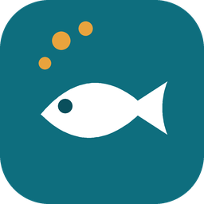
</p>

<h1 align="center">FishFeed</h1>

<p align="center">
  Pemberi pakan ikan otomatis berbasis ESP32 dengan aplikasi Flutter.<br>
  <i>An ESP32 automatic fish feeder with a Flutter companion app.</i>
</p>

<p align="center">
  <a href="https://github.com/khaichi11/Aplikasi-Sistem-Tertanam-FishFeed/actions/workflows/ci.yml"></a>
</p>

<p align="center">
  <a href="#bahasa-indonesia">Bahasa Indonesia</a> · <a href="#english">English</a>
</p>

<table>
  <tr>
    <td align="center" width="25%">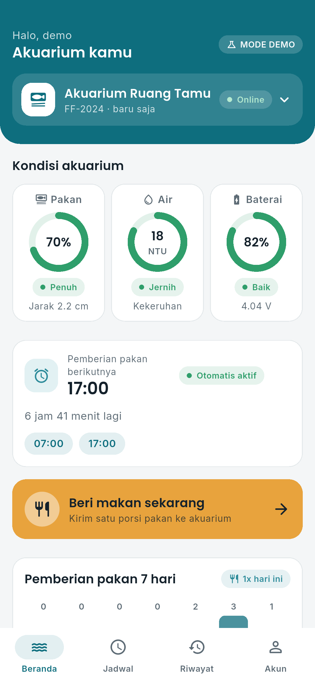<br><sub>Dashboard</sub></td>
    <td align="center" width="25%">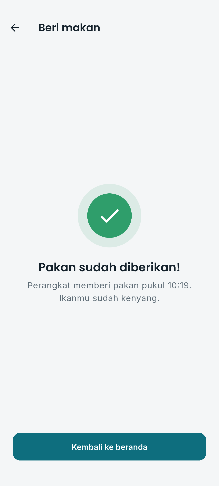<br><sub>Beri makan / Feed now</sub></td>
    <td align="center" width="25%">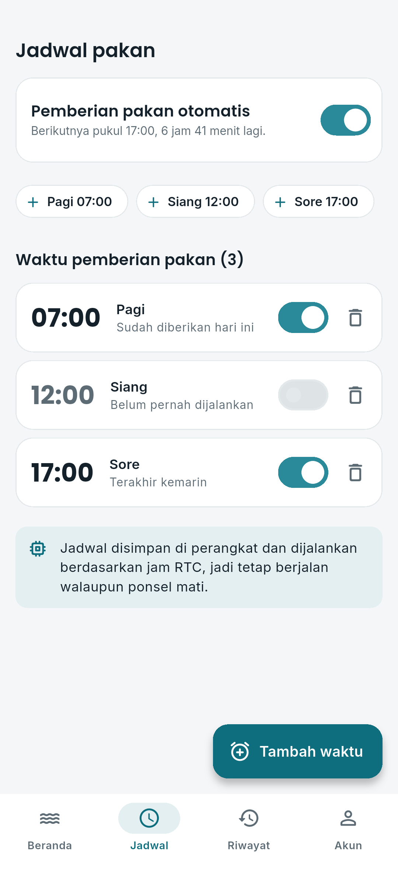<br><sub>Jadwal / Schedule</sub></td>
    <td align="center" width="25%">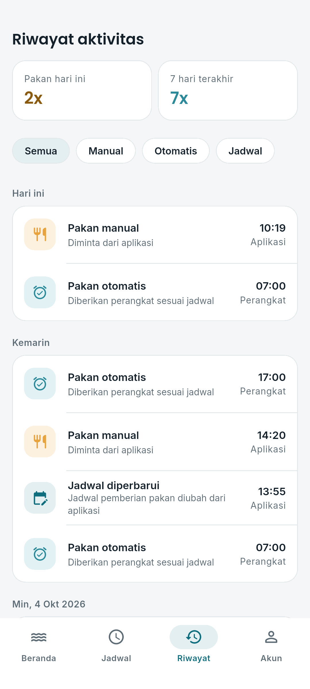<br><sub>Riwayat / History</sub></td>
  </tr>
</table>

---

## Bahasa Indonesia

### Tentang

FishFeed terdiri dari dua bagian:

- **Firmware ESP32** ([`Final_Embed/`](Final_Embed)) membaca sisa pakan, kekeruhan
  air dan baterai, menggerakkan servo pakan, serta menjalankan jadwal dengan jam
  RTC. Tugas berjalan sebagai task FreeRTOS dan perangkat tidur (deep sleep)
  di antara siklus untuk menghemat daya.
- **Aplikasi Flutter** ([`embed/`](embed)) untuk memantau akuarium, memberi
  pakan dari jauh, mengatur jadwal, dan melihat riwayat.

Aplikasi dan perangkat tidak terhubung langsung. Semua data lewat Firebase,
jadi keduanya tidak perlu berada di jaringan yang sama.

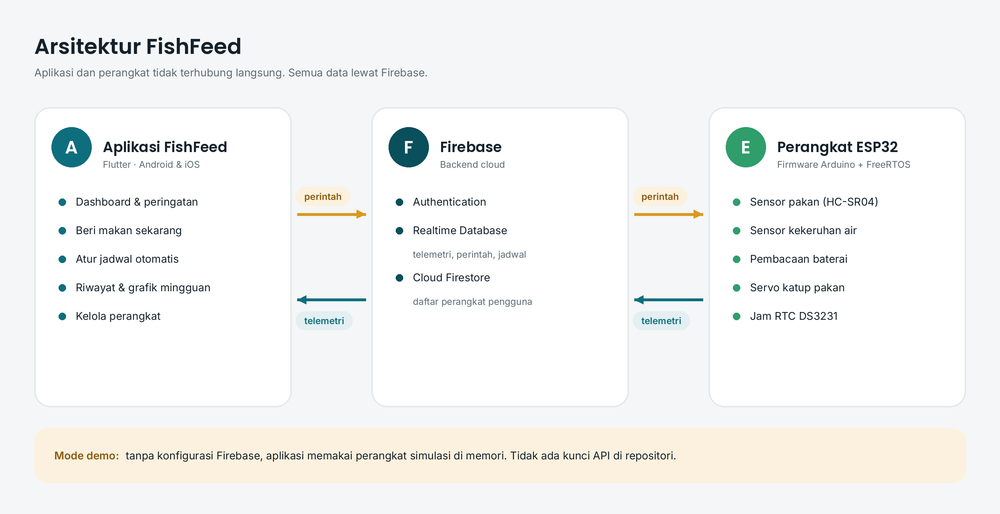

### Fitur aplikasi

- **Dashboard** dengan cincin indikator sisa pakan, kejernihan air, dan baterai,
  serta peringatan otomatis: pakan menipis atau habis, air keruh, baterai lemah,
  dan perangkat offline.
- **Beri makan sekarang** dengan konfirmasi. Aplikasi menunggu sampai perangkat
  benar-benar menjatuhkan pakan, lalu menampilkan "Pakan sudah diberikan".
- **Jadwal otomatis**: tambah waktu (atau pilih Pagi, Siang, Sore), aktifkan
  atau matikan per waktu, lihat kapan terakhir dijalankan, dan hitung mundur ke
  pemberian berikutnya.
- **Riwayat** dikelompokkan per hari dengan filter Manual, Otomatis, dan Jadwal,
  plus grafik pemberian pakan 7 hari.
- **Kelola perangkat**: pasangkan dengan ID, ganti nama, lepas, dan pilih
  perangkat aktif. Satu akun bisa memegang beberapa perangkat.
- **Mode demo**: tanpa konfigurasi Firebase, aplikasi memakai perangkat simulasi,
  jadi bisa dicoba langsung tanpa alat dan tanpa kunci API.

### Tangkapan layar

<table>
  <tr>
    <td align="center" width="25%">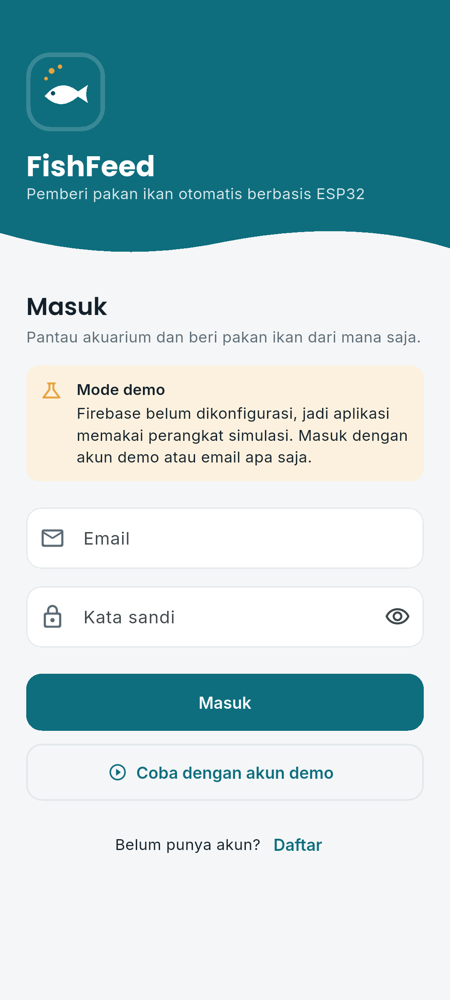<br><sub>Masuk</sub></td>
    <td align="center" width="25%"><br><sub>Dashboard</sub></td>
    <td align="center" width="25%">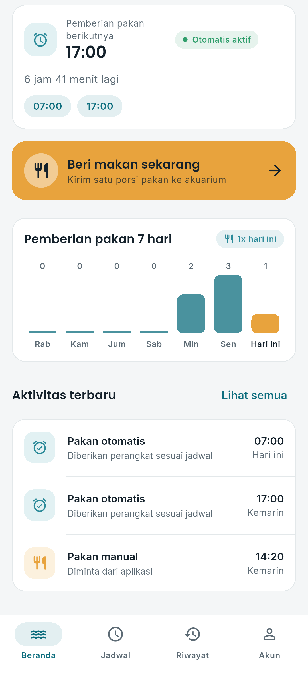<br><sub>Grafik dan aktivitas</sub></td>
    <td align="center" width="25%">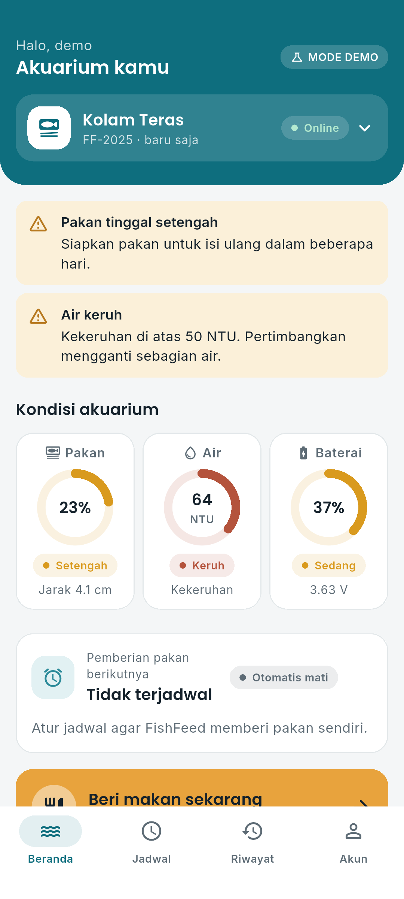<br><sub>Peringatan</sub></td>
  </tr>
  <tr>
    <td align="center" width="25%"><br><sub>Beri makan</sub></td>
    <td align="center" width="25%"><br><sub>Jadwal</sub></td>
    <td align="center" width="25%"><br><sub>Riwayat</sub></td>
    <td align="center" width="25%">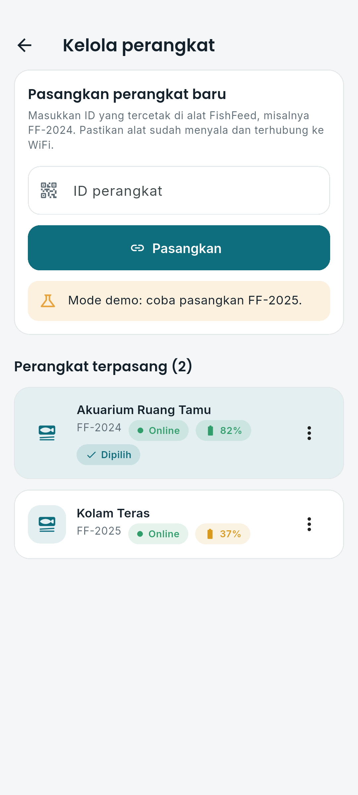<br><sub>Kelola perangkat</sub></td>
  </tr>
  <tr>
    <td align="center" width="25%">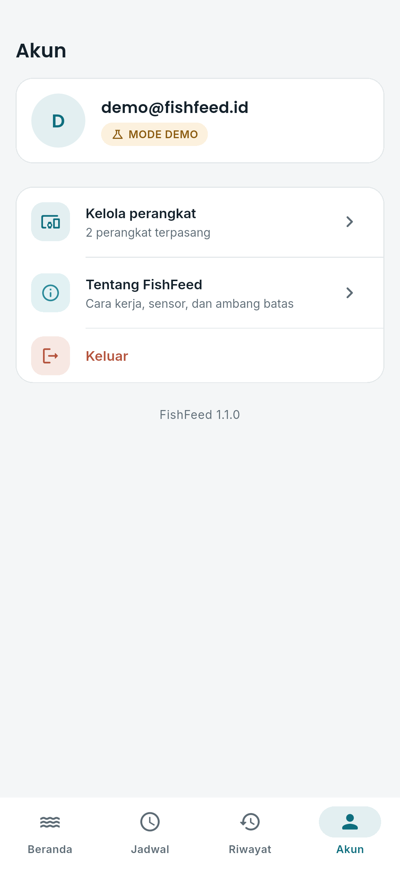<br><sub>Akun</sub></td>
    <td align="center" width="25%">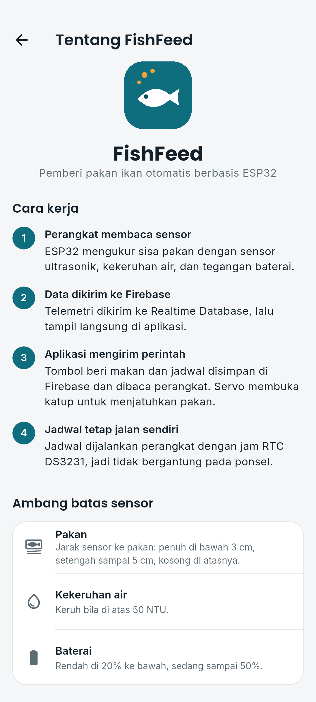<br><sub>Tentang</sub></td>
    <td width="25%"></td>
    <td width="25%"></td>
  </tr>
</table>

Semua tangkapan layar dibuat otomatis oleh integration test di emulator Android
dalam mode demo.

### Alur pemberian pakan

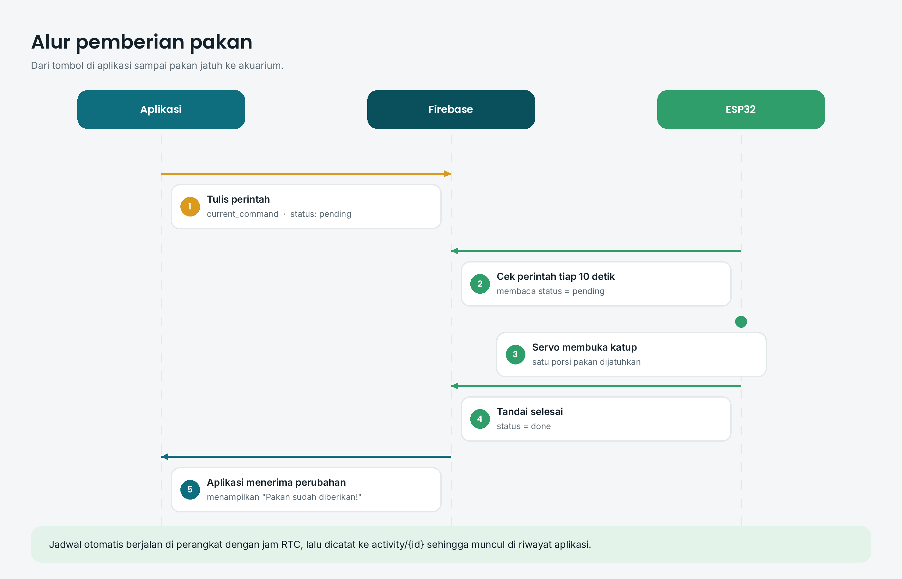

### Perangkat keras

| Komponen | Fungsi |
| --- | --- |
| ESP32 DevKit V1 | Pengendali utama |
| RTC DS3231 | Jam untuk jadwal, tetap jalan saat WiFi mati |
| Sensor ultrasonik HC-SR04 | Mengukur jarak ke permukaan pakan |
| Sensor kekeruhan | Mengukur kekeruhan air (NTU) |
| Servo | Membuka katup penjatuh pakan |
| Baterai + pembagi tegangan | Sumber daya dan pembacaan persentase |

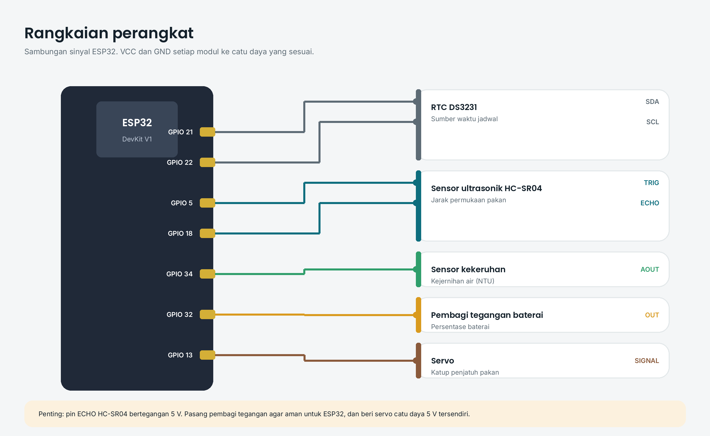

| Pin ESP32 | Sambungan |
| --- | --- |
| GPIO 21 | SDA RTC DS3231 |
| GPIO 22 | SCL RTC DS3231 |
| GPIO 5 | TRIG sensor ultrasonik |
| GPIO 18 | ECHO sensor ultrasonik (lewat pembagi tegangan 5 V ke 3,3 V) |
| GPIO 34 | Keluaran analog sensor kekeruhan |
| GPIO 32 | Pembagi tegangan baterai |
| GPIO 13 | Sinyal servo |

### Struktur data Firebase

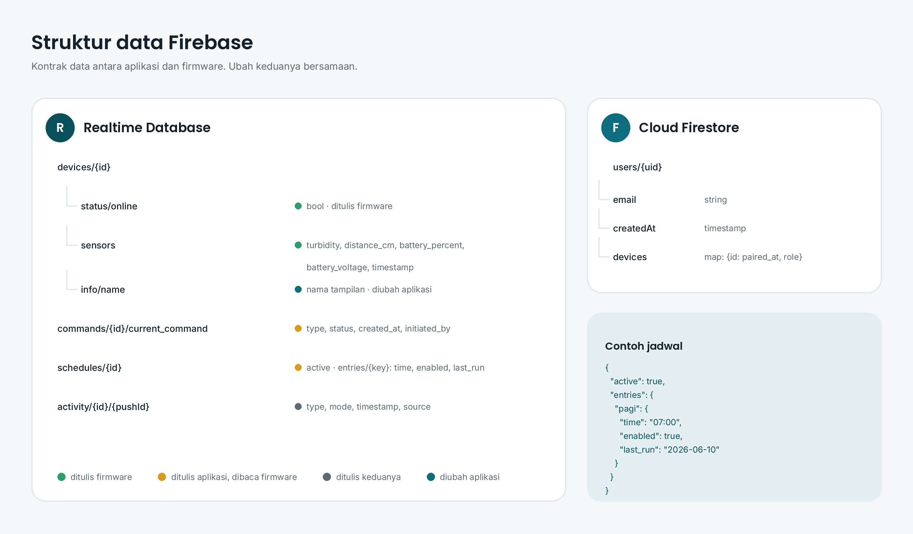

Firmware dan aplikasi memakai format yang sama. Bila salah satu diubah, ubah
juga yang lain.

### Menjalankan aplikasi

Diperlukan Flutter 3.41 dan Android SDK.

```bash
cd embed
flutter pub get
flutter run            # mode demo, tanpa Firebase
```

Masuk dengan tombol **Coba dengan akun demo**, atau email apa saja. Di halaman
Kelola perangkat, coba pasangkan `FF-2025`.

#### Mode Firebase (alat sungguhan)

1. Buat proyek di [Firebase Console](https://console.firebase.google.com),
   aktifkan **Authentication** (Email/Password), **Realtime Database**, dan
   **Cloud Firestore**.
2. Pasang aturan keamanan dari
   [`docs/firebase/database.rules.json`](docs/firebase/database.rules.json) dan
   [`docs/firebase/firestore.rules`](docs/firebase/firestore.rules).
3. Daftarkan aplikasi Android, lalu salin `embed/firebase.example.json` menjadi
   `embed/firebase.json` dan isi nilainya. Berkas ini tidak pernah di-commit.
4. Jalankan:

```bash
flutter run --dart-define-from-file=firebase.json
flutter build apk --release --dart-define-from-file=firebase.json
```

Tidak perlu `google-services.json`; konfigurasi dibaca saat build. Bila
konfigurasi tidak lengkap, aplikasi otomatis memakai mode demo.

### Mengunggah firmware

Diperlukan Arduino IDE atau `arduino-cli` dengan papan **ESP32** dan pustaka
**Firebase Arduino Client Library for ESP8266 and ESP32**, **ESP32Servo**, dan
**RTClib**.

1. Salin `Final_Embed/config.example.h` menjadi `Final_Embed/config.h`.
2. Isi WiFi, kunci Firebase, akun perangkat (buat satu pengguna Email/Password
   khusus alat di Firebase Authentication), dan `DEVICE_ID`.
3. Buka `Final_Embed/Final_Embed.ino`, pilih papan **ESP32 Dev Module**, lalu
   unggah.
4. Agar bisa dipasangkan di aplikasi, buat `devices/{DEVICE_ID}/info/name` di
   Realtime Database (misalnya "Akuarium Ruang Tamu").

`config.h` berisi kredensial dan diabaikan oleh Git.

Firmware memakai sekitar 96% ruang program pada skema partisi bawaan, karena
pustaka Firebase cukup besar. Bila menambah fitur dan ruang tidak cukup, pilih
**Tools > Partition Scheme > Huge APP (3MB No OTA)**.

Cara kerja satu siklus: perangkat bangun, membaca sensor, terhubung ke WiFi dan
Firebase, mengirim data, mengecek perintah dan jadwal selama 5 detik, lalu
tidur 5 detik. Bila WiFi atau Firebase tidak tersedia, perangkat tidur 30 detik
dan mencoba lagi, tanpa macet. RTC disinkronkan dengan NTP saat pertama
menyala dan kira-kira setiap 2 jam.

### Pengujian

```bash
cd embed
flutter analyze
flutter test           # logika, data demo, dan alur layar
flutter drive --driver=test_driver/integration_test.dart \
  --target=integration_test/screenshots_test.dart   # di emulator, membuat tangkapan layar
```

CI GitHub Actions menjalankan analisis dan tes aplikasi, membangun APK, dan
mengompilasi firmware untuk ESP32.

### Struktur repositori

```
Final_Embed/          Firmware ESP32 (Arduino + FreeRTOS)
embed/                Aplikasi Flutter
  lib/data/           Backend Firebase dan mode demo
  lib/logic/          Status sensor, peringatan, jadwal, statistik
  lib/models/         Model data sesuai kontrak firmware
  lib/ui/             Halaman, tema, dan widget
  tool/               Pembuat ikon aplikasi
docs/images/          Tangkapan layar dan diagram
docs/firebase/        Aturan keamanan Firebase
tools/                Pembuat diagram dokumentasi
```

### Keamanan

Kredensial WiFi dan Firebase tidak pernah disimpan di repositori. Riwayat Git
sudah dibersihkan dari kata sandi yang sempat ter-commit. Bila kata sandi WiFi
atau akun perangkat lama masih dipakai, sebaiknya diganti.

### Lisensi aset

Logo, ikon, diagram, dan tangkapan layar dibuat khusus untuk proyek ini. Font
Poppins dan Inter memakai SIL Open Font License. Ikon antarmuka berasal dari
Material Icons (Apache 2.0).

---

## English

### About

FishFeed has two parts:

- **ESP32 firmware** ([`Final_Embed/`](Final_Embed)) reads the feed level, water
  turbidity and battery, drives the feeding servo and runs schedules with an RTC
  clock. Work runs as FreeRTOS tasks, and the board deep-sleeps between cycles to
  save power.
- **Flutter app** ([`embed/`](embed)) to monitor the aquarium, feed remotely,
  manage schedules and review history.

The app and the device never talk directly. All data goes through Firebase, so
they do not need to share a network. See the architecture, feed flow, wiring
and data structure diagrams in the Indonesian section above.

### App features

- **Dashboard** with ring gauges for feed level, water clarity and battery, and
  automatic warnings for low or empty feed, cloudy water, low battery and an
  offline device.
- **Feed now** with confirmation. The app waits until the device has actually
  dropped the food and then shows "Pakan sudah diberikan".
- **Automatic schedule**: add times (or Morning, Noon, Evening presets), toggle
  each time, see when it last ran and a countdown to the next feeding.
- **History** grouped by day with Manual, Automatic and Schedule filters, plus a
  7-day feeding chart.
- **Device management**: pair by ID, rename, unpair and switch devices. One
  account can hold several devices.
- **Demo mode**: without Firebase configuration the app uses a simulated device,
  so it runs straight away without hardware or API keys.

### Running the app

```bash
cd embed
flutter pub get
flutter run                                         # demo mode
flutter run --dart-define-from-file=firebase.json   # real Firebase
```

For Firebase mode, enable Email/Password Authentication, Realtime Database and
Cloud Firestore, apply the rules in [`docs/firebase/`](docs/firebase), and copy
`embed/firebase.example.json` to `embed/firebase.json` with your values. No
`google-services.json` is needed, and `firebase.json` is never committed.

### Flashing the firmware

Install the ESP32 board package and the **Firebase Arduino Client Library for
ESP8266 and ESP32**, **ESP32Servo** and **RTClib** libraries. Copy
`Final_Embed/config.example.h` to `Final_Embed/config.h`, fill in WiFi, Firebase
keys, a dedicated device user and `DEVICE_ID`, then upload
`Final_Embed/Final_Embed.ino` to an **ESP32 Dev Module**. Create
`devices/{DEVICE_ID}/info/name` in the Realtime Database so the device can be
paired in the app. The firmware uses about 96% of program space with the
default partition scheme; if you add features, pick **Huge APP (3MB No OTA)**.

Each cycle the device wakes up, reads its sensors, connects to WiFi and
Firebase, sends data, checks commands and schedules for 5 seconds and sleeps
for 5 seconds. Without WiFi or Firebase it sleeps for 30 seconds and retries
instead of hanging. The RTC is synced over NTP on first boot and about every
two hours.

### Testing

`flutter analyze` and `flutter test` cover the logic, the demo backend and the
screen flows. The integration test drives the app on an emulator and saves the
screenshots. GitHub Actions runs the app checks, builds an APK and compiles the
firmware for ESP32.

### Security

WiFi and Firebase credentials are never stored in the repository, and the Git
history has been cleaned of passwords that were once committed. If the old WiFi
or device passwords are still in use, change them.

### Asset licenses

The logo, icons, diagrams and screenshots were made for this project. Poppins
and Inter use the SIL Open Font License. UI icons come from Material Icons
(Apache 2.0).
